# Lab 02 – IPv4 Routing Misconfiguration and Ping Error Analysis

## Overview

This lab compares three common IPv4 configuration failures in Windows:

1. An incorrect default gateway
2. A missing default gateway
3. An incorrect static IPv4 address

The purpose of this lab is to observe how each configuration affects communication with local and remote destinations, and how different `ping` messages can help identify the cause of a network problem.

---

## Environment

- Windows 11 virtual machine
- Oracle VirtualBox
- VirtualBox NAT networking
- Network adapter: Intel(R) PRO/1000 MT Desktop Adapter
- Local subnet: `10.0.2.0/24`
- Normal client address: `10.0.2.15`
- Correct default gateway: `10.0.2.2`
- Local test destination: `10.0.2.2`
- Remote test destination: `8.8.8.8`

---

## Testing Method

Two destinations were tested in each scenario:

```powershell
ping 10.0.2.2
ping 8.8.8.8
```

- `10.0.2.2` is located on the directly connected `10.0.2.0/24` subnet.
- `8.8.8.8` is outside the local subnet and requires a valid default gateway.

---

## Baseline Configuration

The virtual machine initially received its IPv4 configuration automatically through DHCP.

```text
IPv4 address:     10.0.2.15
Subnet mask:      255.255.255.0
Default gateway:  10.0.2.2
DHCP enabled:     Yes
```

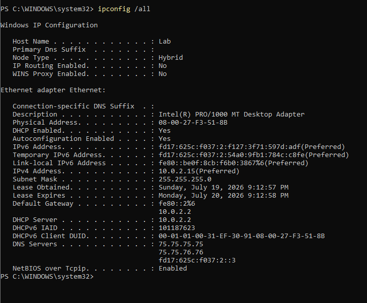

This configuration provides both local-subnet connectivity and access to remote networks.

---

# Scenario 1 – Incorrect Default Gateway

## Fault Configuration

The correct IPv4 address and subnet mask were retained, but the default gateway was changed to an address that did not exist.

```text
IPv4 address:     10.0.2.15
Subnet mask:      255.255.255.0
Default gateway:  10.0.2.100
```

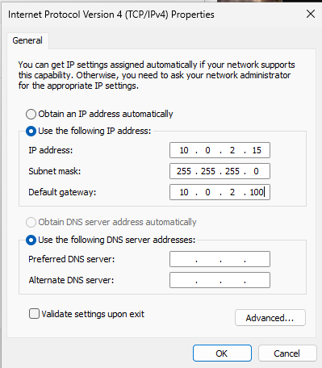

The configuration was verified with:

```powershell
ipconfig /all
```

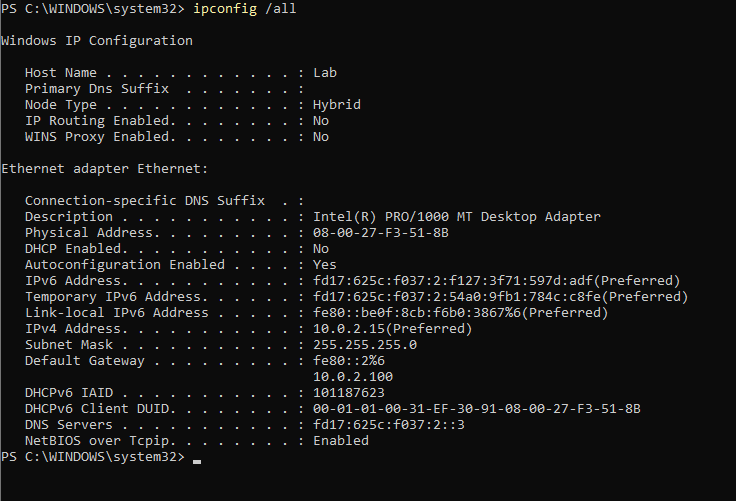

## Local-Subnet Connectivity Test

```powershell
ping 10.0.2.2
```

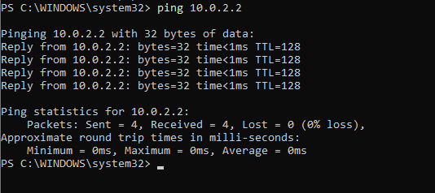

The local ping succeeded because both `10.0.2.15` and `10.0.2.2` belong to the directly connected `10.0.2.0/24` subnet.

Windows does not use the default gateway for communication with a destination on the same subnet. Instead, it uses ARP to resolve the destination's MAC address and sends the traffic directly.

## Remote Connectivity Test

```powershell
ping 8.8.8.8
```

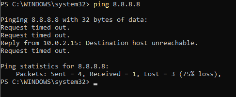

Because `8.8.8.8` is outside the local subnet, Windows attempted to forward the traffic to the configured default gateway, `10.0.2.100`.

The configured gateway did not exist and did not respond to ARP requests. The test produced messages such as:

```text
Request timed out.
Reply from 10.0.2.15: Destination host unreachable.
```

## Scenario 1 Analysis

The client could still communicate with devices on its directly connected subnet, but it could not reach remote networks because the configured next-hop gateway was unreachable.

---

# Scenario 2 – Missing Default Gateway

## Fault Configuration

The correct IPv4 address and subnet mask were configured, but the default gateway was left blank.

```text
IPv4 address:     10.0.2.15
Subnet mask:      255.255.255.0
Default gateway:  None
```

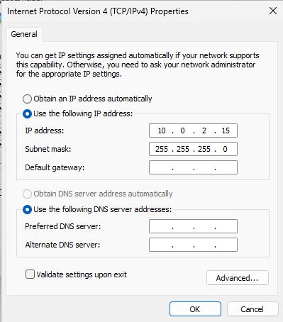

The configuration was verified with:

```powershell
ipconfig /all
```

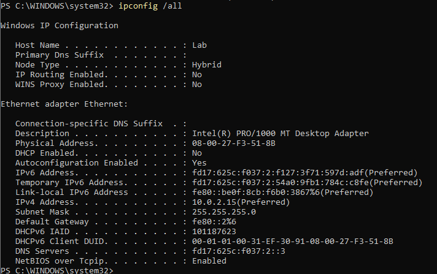

## Local-Subnet Connectivity Test

```powershell
ping 10.0.2.2
```

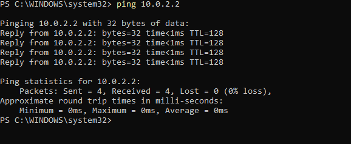

The local ping still succeeded because the destination was located on the directly connected subnet.

A default gateway is not required for communication between devices on the same subnet.

## Remote Connectivity Test

```powershell
ping 8.8.8.8
```

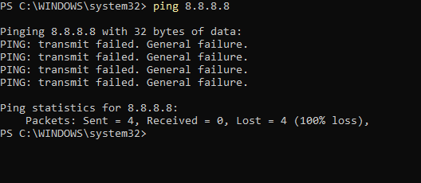

The command returned:

```text
PING: transmit failed. General failure.
```

## Scenario 2 Analysis

Windows had a directly connected route for `10.0.2.0/24`, allowing local communication.

However, no default route existed for destinations outside the local subnet. Windows therefore could not determine a valid next hop for `8.8.8.8`, and the packet was not transmitted successfully.

---

# Scenario 3 – Incorrect Static IPv4 Address with No Default Gateway

## Fault Configuration

The client was assigned an IPv4 address outside the actual VirtualBox NAT subnet, and no default gateway was configured.

```text
IPv4 address:     100.0.2.15
Subnet mask:      255.255.255.0
Default gateway:  None
```

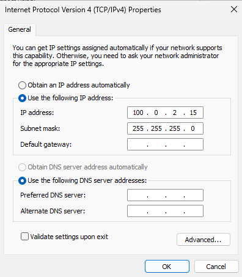

The configuration was verified with:

```powershell
ipconfig /all
```

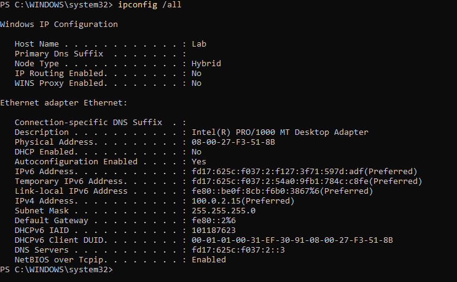

With this configuration, Windows considered the directly connected subnet to be:

```text
100.0.2.0/24
```

The actual VirtualBox NAT subnet remained:

```text
10.0.2.0/24
```

## Local Network Test

```powershell
ping 10.0.2.2
```

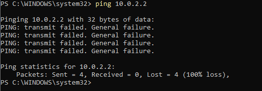

The command returned:

```text
PING: transmit failed. General failure.
```

The destination `10.0.2.2` was no longer considered directly connected because the client believed it belonged to `100.0.2.0/24`.

Since no default gateway was configured, Windows had no route to the actual local network.

## Remote Network Test

```powershell
ping 8.8.8.8
```

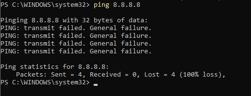

The remote test also returned:

```text
PING: transmit failed. General failure.
```

## Scenario 3 Analysis

The incorrect static IPv4 address placed the computer on the wrong logical subnet.

Because no default gateway was configured, Windows had no usable route to either the actual VirtualBox local subnet or the remote Internet destination.

---

# Comparison of Results

| Configuration | Ping `10.0.2.2` | Ping `8.8.8.8` | Interpretation |
|---|---|---|---|
| Correct IP with incorrect gateway | Successful | Timeout or destination unreachable | Local route works, but the configured next hop cannot be reached |
| Correct IP with no gateway | Successful | General failure | Local route exists, but no default route exists |
| Incorrect IP with no gateway | General failure | General failure | The client is on the wrong logical subnet and has no route to either destination |
| DHCP restored | Successful | Successful | Correct IP address, subnet mask and gateway restored |

---

# Understanding the Ping Messages

## Request Timed Out

```text
Request timed out.
```

This means that `ping` did not receive an ICMP response before the timeout period expired.

A timeout does not identify one specific root cause. Possible causes include:

- Packet loss
- Firewall filtering
- An unreachable gateway
- An unresponsive destination
- Routing problems

In this lab, the timeout occurred while Windows was attempting to send remote traffic through an unreachable configured gateway.

---

## Destination Host Unreachable

```text
Reply from 10.0.2.15: Destination host unreachable.
```

The message was generated by the local client at `10.0.2.15`.

In this scenario, Windows selected the configured default gateway as the next hop but could not resolve or reach that gateway.

This indicates that Windows had a route selected, but the next-hop device was unavailable.

---

## General Failure

```text
PING: transmit failed. General failure.
```

This indicates that the Windows networking stack could not successfully transmit the packet.

In this lab, it appeared when:

- No default gateway or default route was available
- The configured IPv4 address placed the system on the wrong subnet
- Windows had no usable route to the requested destination

`General failure` is a broad local error and may also occur during other interface, routing or TCP/IP stack problems.

---

# Resolution

The adapter was returned to automatic IPv4 and DNS configuration.

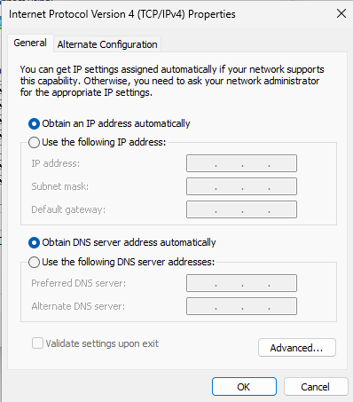

The restored configuration was verified with:

```powershell
ipconfig /all
```

The adapter successfully received:

```text
DHCP enabled:     Yes
IPv4 address:     10.0.2.15
Subnet mask:      255.255.255.0
Default gateway:  10.0.2.2
```

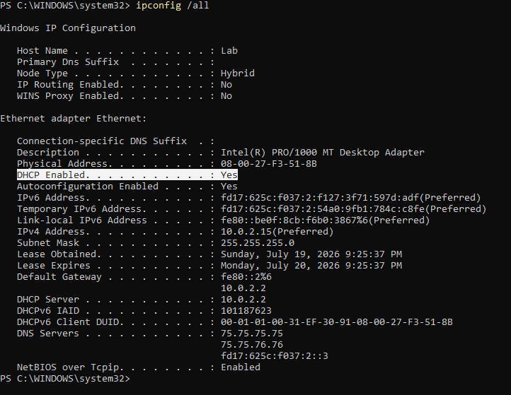

## Verify Local Connectivity

```powershell
ping 10.0.2.2
```

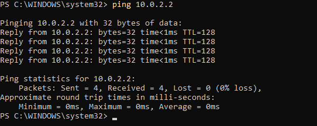

## Verify Remote Connectivity

```powershell
ping 8.8.8.8
```

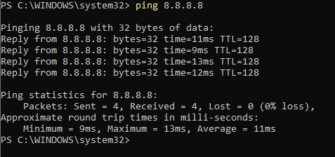

Both the local and remote connectivity tests succeeded after DHCP was restored.

---

# Root Causes

The lab demonstrated three separate IPv4 configuration failures:

1. The configured default gateway did not exist.
2. No default gateway or default route was configured.
3. The static IPv4 address did not belong to the actual connected subnet.

---

# Key Findings

- Devices on the same subnet communicate without using the default gateway.
- A default gateway is required to reach destinations outside the local subnet.
- An incorrect gateway can leave LAN communication working while remote communication fails.
- A missing gateway does not prevent directly connected subnet communication.
- An incorrect IPv4 address changes which destinations Windows considers directly connected.
- `Destination host unreachable` indicates that a route may have been selected but the next hop could not be reached.
- `General failure` indicates that Windows could not successfully transmit the packet.
- Ping output should be analyzed together with the IP configuration and routing table.

---

# Skills Demonstrated

- Windows 11 network configuration
- IPv4 addressing
- Subnet identification
- Default gateway troubleshooting
- Static IPv4 troubleshooting
- Directly connected routes
- Default route analysis
- ARP and next-hop resolution
- ICMP and ping output analysis
- DHCP recovery
- PowerShell
- Windows command-line networking tools
- VirtualBox NAT networking
  
