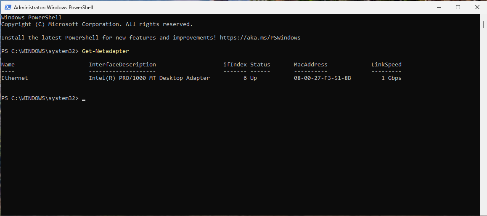
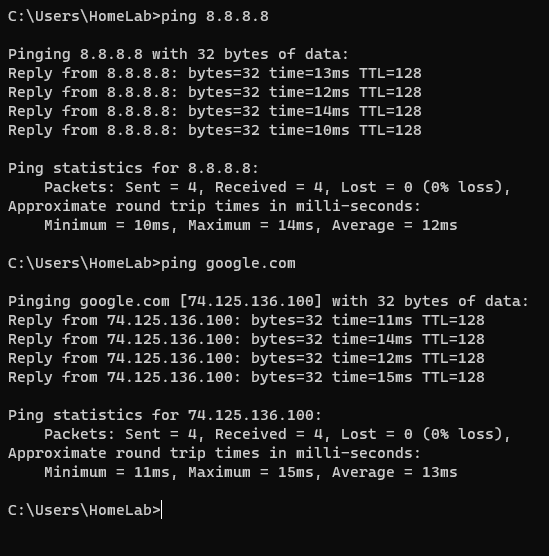
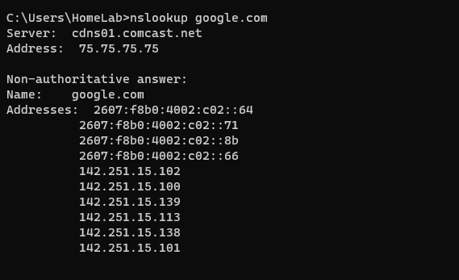
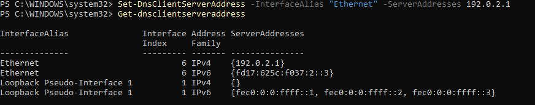
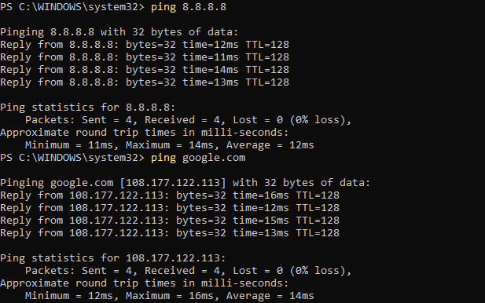
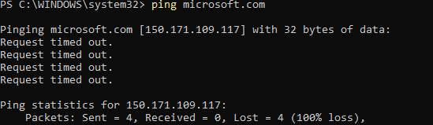
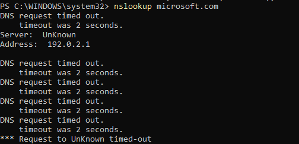
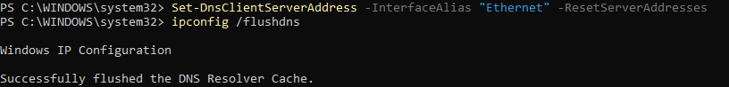
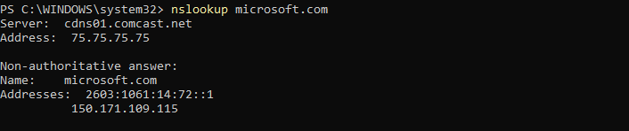

# Lab 01 - DNS Resolution Failure Troubleshooting

## Objective

Simulate a DNS resolution failure by configuring an invalid DNS server and troubleshoot the issue using Windows networking tools.

---

## Environment

- Windows 11
- Oracle VirtualBox
- NAT Network
- PowerShell

---

## Symptoms

- Able to ping an IP address (8.8.8.8)
- Unable to resolve domain names
- nslookup timed out

---

## Diagnostic Steps

1. Verified network adapter status

```
Get-NetAdapter
```


2. Verified IP configuration

```
ipconfig /all
```


3. Tested Internet connectivity

```
ping 8.8.8.8
ping google.com
```


4. Verified DNS resolution

```
nslookup google.com
```


5. Changed DNS server

```
Set-DnsClientServerAddress -InterfaceAlias "Ethernet" -ServerAddresses 192.0.2.1
```


6. Verified DNS configuration

```
Get-DnsClientServerAddress
```


7. Cleared DNS cache

```
ipconfig /flushdns
```


8. Tested DNS resolution again

```
ping microsoft.com
nslookup microsoft.com
```



9. Restored DNS

```
Set-DnsClientServerAddress -InterfaceAlias "Ethernet" -ResetServerAddresses
```


10. Verified successful resolution

```
nslookup microsoft.com
```


---

## Root Cause

The network adapter was configured with an invalid DNS server address (192.0.2.1), preventing hostname resolution while IP connectivity remained functional.

---

## Resolution

Reset the DNS server configuration to obtain DNS settings automatically via DHCP and flushed the DNS cache.

---

## Skills Demonstrated

- Windows DNS troubleshooting
- PowerShell
- Network diagnostics
- ipconfig
- ping
- nslookup
- DNS cache management
